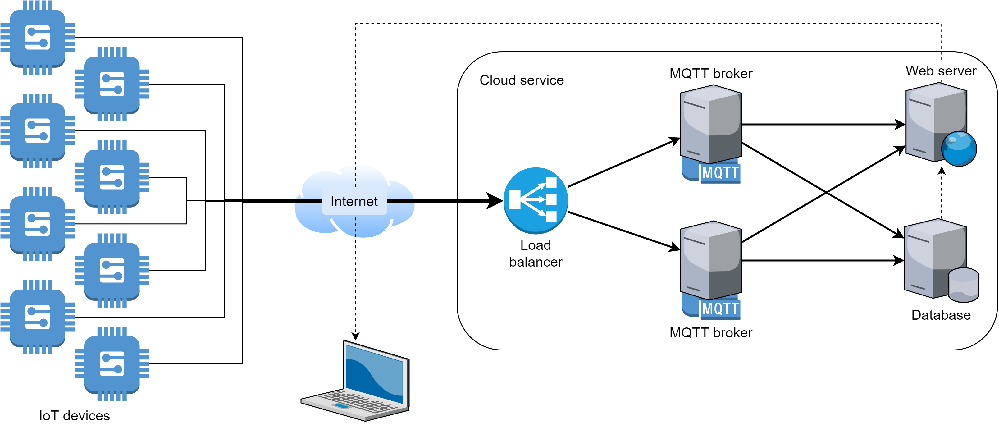
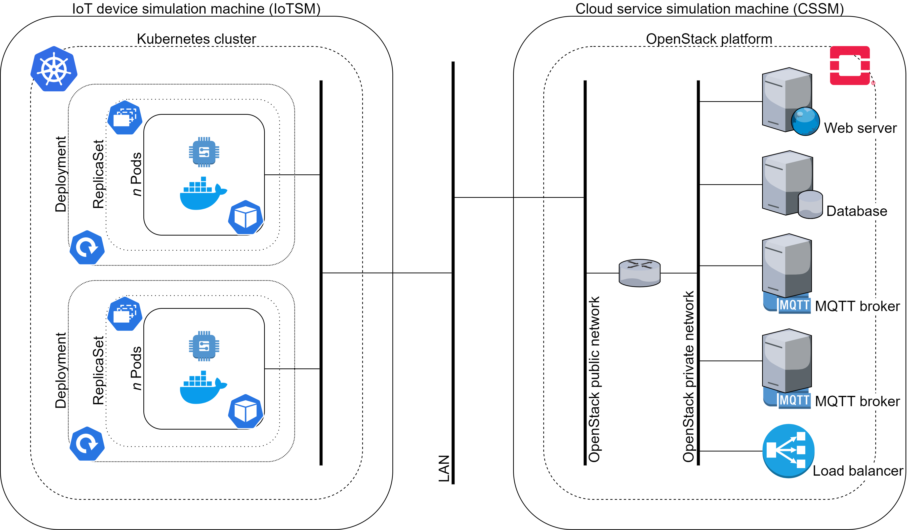

# MQTT simulation testbed

Della Giustina, Fabio - fabio.dellagiustina@studenti.unitn.it  
Barcellesi, Jacopo - jacopo.barcellesi@studenti.unitn.it

## Introduction
This project aims to implement a testbed to simulate the communication among Internet of Things (IoT) devices through an MQTT infrastructure.

## MQTT
MQTT (Message Queuing Telemetry Transport) is a well-known lightweight messaging protocol designed for machine-to-machine (M2M) and IoT communications. It defines two types of network entities: message brokers (usually one) and many clients. An MQTT broker is a server that receives all the messages sent by clients connected to it and reroutes them to other clients. An MQTT client is any device connected to the broker that sends or receives (or both) MQTT messages. When a client wants to send a message, a "topic" must be specified (it publishes a message on a topic). The broker will redirect that message to all clients subscribed to that topic.

## Scenario
The scenario we want to recreate consists of a variable number of **IoT devices** (one or more sensor networks) connected to a cloud service. The cloud service provides message brokers for **data collection**, a database for **data storage** and a web server for **data visualization**. In particular, it provides two MQTT brokers and a load balancer to ensure service availability in case of message overload or broker failure. Finally, data are going to be accessible online through the web server.

## Architecture
The architecture consists of two machines, one to simulate the IoT devices and one the cloud service. Both machines are part of the same network that simulates the Internet.

### IoT device simulation machine
The "IoT device simulation machine" (IoTSM) is going to be implemented through a **Kubernetes** cluster. Two Deployments (and the corresponding ReplicaSets) will act as two different sensor networks. Each Deployment will consist of *n* Pods (*n* defined in the corresponding ReplicaSet), each of which is going to simulate an IoT sensor (MQTT client) through a Docker container. It will be possible to increase or decrease at will the number of Pods to better reproduce the behavior of a sensor network. Finally, each container will send some MQTT messages (every *t* seconds) to the CSSM.

### Cloud service simulation machine
The "cloud service simulation machine" (CSSM) is going to be implemented through an **OpenStack** platform, which will be responsible for the whole part of MQTT data collection, storage and visualization.  
The core function (data collection) will be held by two **MQTT brokers** (implemented in two different virtual machines), that are going to receive the MQTT messages sent by the IoTSM. A **load balancer** will split MQTT traffic in ingress and redistribute it to the brokers. As previously mentioned, this will ensure service availability in case of message overload or broker failure.  
A **database** will be implemented in another instance to store all the MQTT messages received by the brokers. To achieve this, the instance is going to be an MQTT client subscribed to all the topics which the IoT devices are going to publish the messages on.  
To visualize all the messages from outside the platform, a **web server** is going to be implemented in a separate virtual machine. For real-time messages, the instance is going to be an MQTT client subscribed to all the topics (as the database). For old messages instead, the web server is going to query the database.  
Finally, every instance is part of the same private network, which is connected to the external network through a router.
